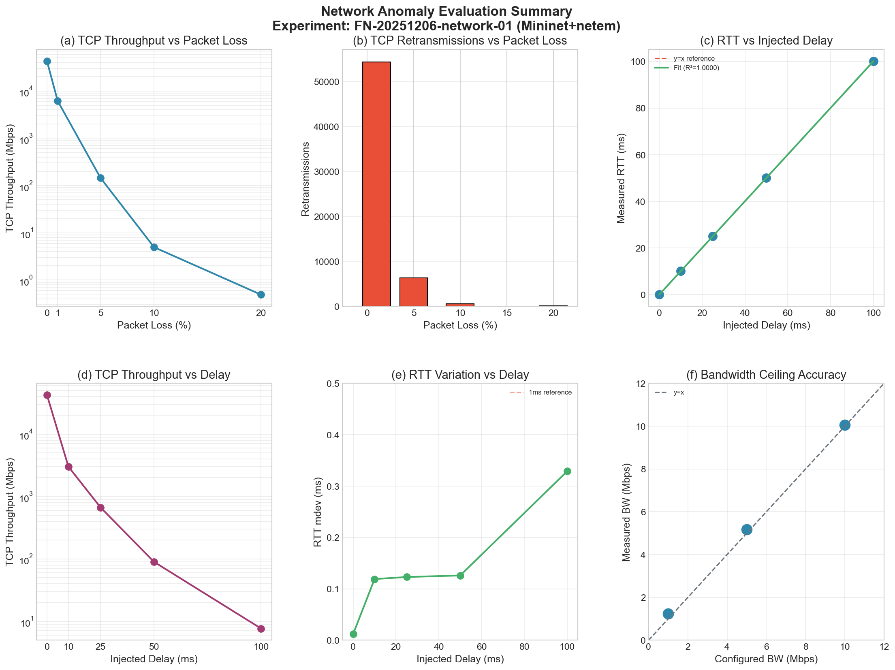
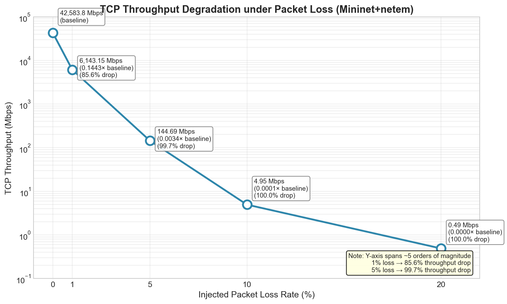
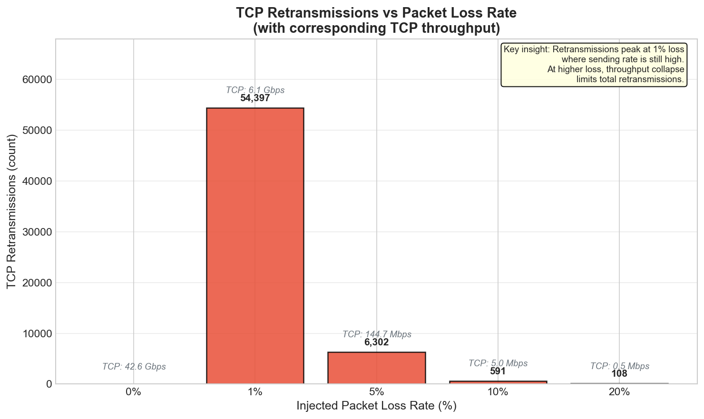
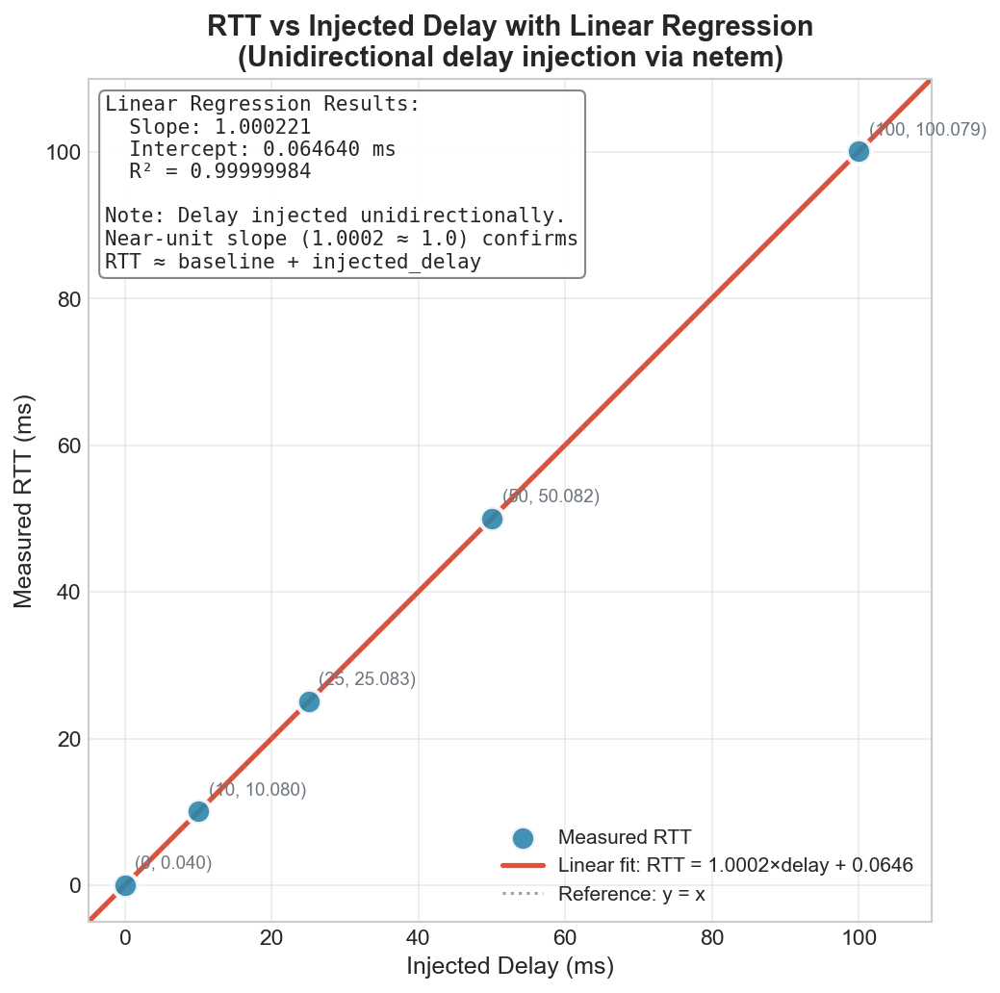
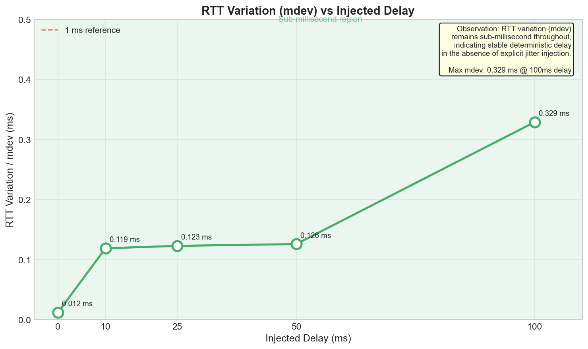
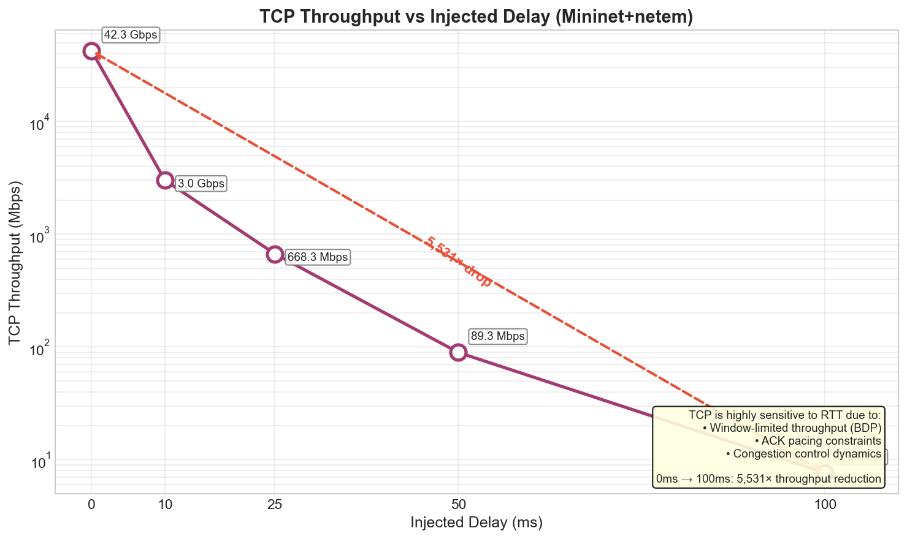
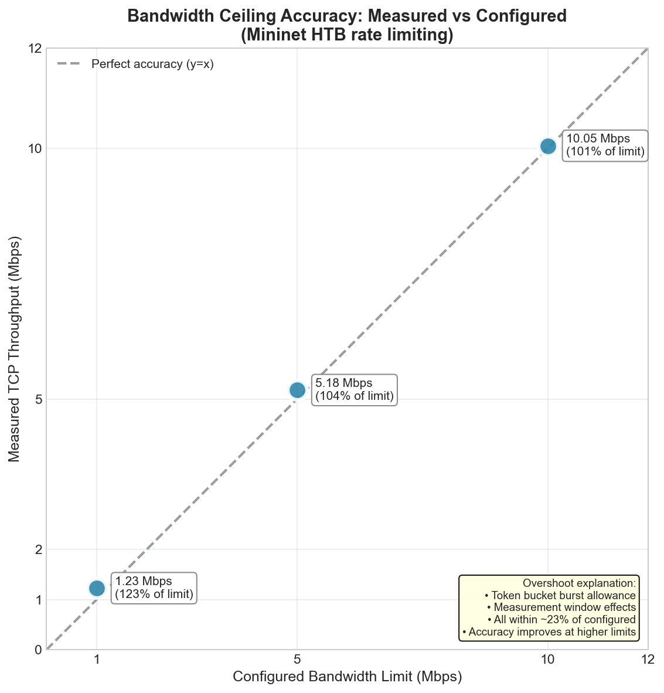
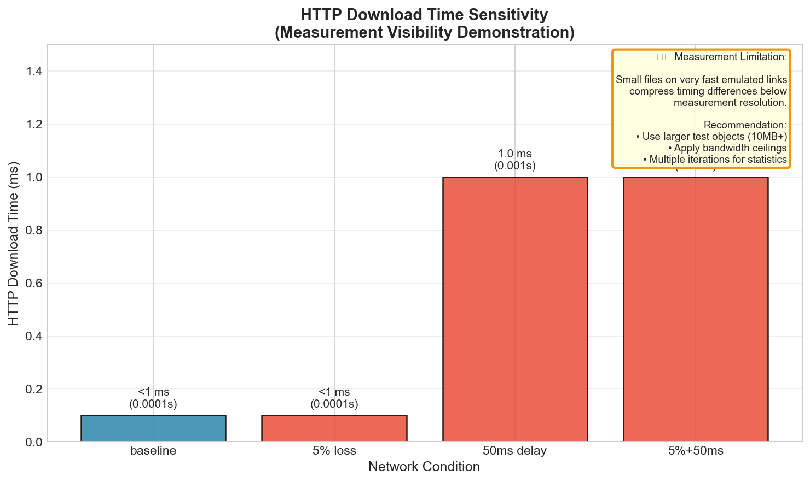

# Evaluating the Performance Impact of Network Anomalies via a Mininet-Based Simulation Framework

---
> **Name:** Network Anomaly Performance Evaluation Framework  
> **Github Repo:** `https://github.com/ViskaWei/FutureNetwork`  
> **Keywords:** `Mininet`, `TCP Performance`, `Packet Loss`, `Latency`, `Bandwidth Throttling`, `Traffic Control`, `netem`, `iperf3`  
> **Author:** Viska Wei  
> **Date:** 2025-12-08  
---

## Abstract

Networked systems increasingly depend on predictable performance despite operating over links that exhibit packet loss, variable latency, jitter, and transient bandwidth drops. These anomalies can disproportionately affect transport protocols and higher-layer behaviors, and in modern distributed workloads—particularly synchronous AI training primitives such as all-reduce—small degradations can amplify into global slowdowns due to barrier synchronization and tail-latency effects. This report presents a Mininet-based simulation framework for controlled, repeatable anomaly injection using Linux traffic control (tc), and evaluates the performance impact of representative anomalies on TCP throughput, round-trip time (RTT), and bandwidth-limited behavior. Experimental results show that TCP goodput degrades extremely sharply under even modest loss (e.g., a reduction from 42,583.8 Mbps at 0% loss to 6,143.15 Mbps at 1% loss and to 4.95 Mbps at 10% loss), while injected delay translates linearly into measured RTT with near-perfect correlation (slope ≈ 1.0 when delay is applied unidirectionally). Bandwidth shaping via token-bucket filtering produces near-target throughput ceilings with small overshoots attributable to burst and measurement effects. The implemented framework is designed as a reusable testbed for coursework and research, supporting multiple topologies, automated experiment orchestration, and extensible traffic workloads beyond microbenchmarks. 

## 1. Background & Motivation

Packet loss, propagation and queueing delay, jitter (delay variation), and bandwidth drops are not exceptional corner cases but recurring realities in operational networks. Wireless links experience time-varying loss and rate adaptation; shared access networks exhibit congestion-induced queueing; and virtualized or multi-tenant environments frequently encounter bandwidth contention and bursty interference. From a systems perspective, these phenomena translate into performance instability that is often more consequential than average-case throughput: retransmissions inflate completion times, jitter widens latency distributions, and bandwidth variability undermines steady-state assumptions in transport and application protocols.

The impact of anomalies is protocol- and workload-dependent. TCP couples reliability with congestion control: random loss, even when not caused by congestion, can trigger multiplicative window reduction and slow recovery, reducing effective goodput and increasing completion time. Increased RTT reduces the ACK clocking rate and inflates the bandwidth-delay product (BDP), raising demands on congestion window growth and socket buffer sizing. UDP, in contrast, typically exports loss directly to the application, so its throughput may remain high while effective delivered data decreases; however, real-time workloads that rely on smoothly timed delivery can deteriorate sharply under jitter. At the application layer, request/response protocols (e.g., HTTP) compound these effects: losses interact with retransmissions and head-of-line blocking, while delay inflates handshake and control-plane latencies, and bandwidth shaping increases transfer time roughly inversely with the available rate under stable conditions.

These issues become especially salient in distributed systems and AI communication patterns. Many distributed data-parallel training schemes use synchronous collectives (e.g., ring all-reduce), in which all workers repeatedly exchange chunks and wait at collective boundaries. In such regimes, a single slow link or transient loss event can stall the entire training step, making tail latency the governing metric rather than the mean. Consequently, understanding how anomalies affect throughput and latency is not merely a networking concern but a systems-level question with direct implications for cluster efficiency and cost.

Despite the relevance, students and researchers often struggle to test anomalies in real networks in a controllable and reproducible manner. Real environments involve uncontrolled cross traffic, hardware variability, and opaque queue management, making experiments difficult to replicate and results hard to attribute. Lightweight emulation approaches address this gap by providing an isolated environment where topologies, impairments, and traffic patterns can be precisely specified and repeated.

Mininet provides a particularly practical foundation for this purpose. By using Linux network namespaces and virtual Ethernet links on a single host, Mininet enables realistic protocol stacks and topological control with low setup overhead and strong reproducibility. When combined with Linux traffic control (tc) and netem/tbf queuing disciplines, Mininet becomes a flexible laboratory for injecting loss, delay, jitter, and rate limits in a controlled way, enabling systematic studies of performance impact and facilitating extensible experimentation for teaching and research. 

## 2. Project Overview

This project develops a reusable **Network Anomalies Injection System** built on Mininet and Linux tc. The system is designed to separate “topology specification” from “anomaly injection” and “measurement,” enabling experiments to be expressed declaratively and executed consistently across runs. At its core, the framework programmatically instantiates Mininet topologies and applies impairments using tc’s netem (for loss/delay/jitter and related effects) and token-bucket filtering (tbf) for bandwidth throttling. The anomaly layer supports parameter sweeps, allowing loss rates, latency values, jitter magnitudes, and bandwidth ceilings to be varied systematically to produce response curves rather than isolated data points.

A key objective is to support operation across multiple topologies. While the presented evaluation primarily uses a minimal host–switch–host topology to isolate single-link effects, the framework is designed to extend naturally to multi-hop line topologies and more complex structures where anomalies can compound across hops. This topology generality enables broader pedagogical coverage—e.g., demonstrating how queueing and delay accumulate—as well as research scenarios involving path diversity or multi-segment bottlenecks.

The framework targets several use cases. First, it supports classic transport measurements including TCP throughput and latency behavior under controlled loss and delay. Second, it enables UDP performance testing with attention to loss delivery and delay variation, which is essential for media-like or telemetry workloads. Third, it provides scaffolding for AI-inspired communication microbenchmarks, such as ring-style message exchanges that emulate all-reduce scheduling and barrier sensitivity, allowing exploration beyond pure throughput into synchronization-driven performance. Finally, the system can be extended to application-level behaviors such as HTTP transfer time and request latency, in order to connect lower-layer impairments to user-perceived outcomes. The roadmap and hypothesis structure for these use cases is captured explicitly to guide incremental experimentation and future extensions. 

## 3. Experiment Setup

All experiments are conducted in a Mininet-based emulation environment running on a Linux host. A reasonable and commonly deployed configuration for such work is **Ubuntu 20.04 LTS** with **Mininet 2.3.x** installed via system packages, **iperf3 3.x** for throughput testing, and **Python 3.8+** for orchestration and auxiliary application servers. This combination balances stability with widespread availability, and aligns with typical course and research lab deployments. 

The primary topology used for evaluation is a minimal **single-switch, two-host** topology (h1—s1—h2). This design is intentional: by keeping the path short and avoiding multi-hop confounders, performance shifts can be more confidently attributed to injected impairments rather than routing effects or internal topology artifacts. At the same time, the framework’s topology layer is designed to support multi-hop line or chained topologies (e.g., h1—s1—s2—h2) to study hop-by-hop compounding in subsequent phases.

Anomaly settings follow systematic sweeps for single-parameter studies. For **packet loss**, experiments sweep loss rates across {0%, 1%, 5%, 10%, 20%}. For **delay**, experiments sweep one-way injected delay across {0, 10, 25, 50, 100 ms} and measure the relationship between configured delay and observed RTT. For **bandwidth throttling**, experiments test shaping ceilings at {1, 5, 10 Mbps}. The system supports jitter injection as well, and the measurement pipeline records RTT dispersion (mdev) as an indicator of observed delay variability, although the reported campaign emphasizes deterministic delay sweeps and notes jitter behavior as an auxiliary observation rather than as a primary independent variable. 

Measurement tools include **iperf3** (TCP throughput and retransmissions), **ping** (RTT statistics and packet loss), and lightweight HTTP serving and download timing (curl-like timing metrics) to probe application-level effects. Additionally, the framework is designed to accommodate custom traffic routines for structured message patterns (e.g., ring exchanges), enabling controlled experimentation with communication schedules that mirror distributed systems behavior.

Reproducibility is addressed through isolation and procedural consistency. Mininet’s namespace-based virtualization isolates flows from the host network, and experiments reset the traffic control configuration between runs to avoid state carryover. Measurements are taken under fixed topology and fixed impairment parameters; repeated runs can be used to quantify variability, and results are recorded in structured form to allow re-plotting and post-hoc analysis. In practice, some sources of nondeterminism remain—e.g., kernel scheduling and netem’s statistical impairment model—so the framework emphasizes repeated measurement and clear recording of environment versions and parameters rather than relying on strict deterministic seeding at the qdisc level. 

## 4. System Design

The framework is organized as a layered system in which each layer encapsulates a distinct responsibility and exposes a clean interface to adjacent components. The **Mininet topology layer** constructs the emulated network, instantiating hosts, switches, and links with explicit interface naming and predictable addressing. This layer defines not only the structure of the network (e.g., single-switch versus multi-hop) but also the mapping from abstract links to concrete Linux interfaces, which is essential for precise impairment placement.

Above it, the **anomaly injection layer** configures link impairments using Linux tc. For loss/delay/jitter-like effects, it applies netem queuing disciplines on the appropriate egress device(s). For bandwidth throttling, it applies token bucket filters (tbf) to enforce rate ceilings and manage burst and latency parameters. This layer is designed to support both point configurations (e.g., “apply 5% loss”) and parameter sweeps (e.g., “iterate loss in {0,1,5,10,20}”), enabling structured experimental designs. A practical subtlety highlighted by the evaluation is directionality: applying netem delay on a single egress interface introduces delay in that direction, which affects RTT measurements asymmetrically unless configured on both directions, and the framework therefore treats “unidirectional vs bidirectional” injection as an explicit experimental choice rather than an implicit assumption. 

The **measurement layer** executes traffic generation and probes. For transport benchmarks, it drives iperf3 servers/clients on designated hosts and collects reported throughput and retransmission statistics. For latency measurements, it runs ping-based probes and records min/avg/max/mdev metrics. For application-level measurements, it can start a lightweight HTTP server and measure download completion time under varying anomalies. Importantly, the measurement layer is designed to be decoupled from the anomaly layer, so that the same measurement routine can be re-executed under different impairment configurations without modification, ensuring consistent methodology across a sweep.

An **automation and experiment orchestration layer** binds topology, anomaly, and measurement into repeatable pipelines. It is responsible for sequencing experiments, resetting state between runs, handling process lifecycle (e.g., ensuring servers are started before clients), and emitting results in a structured format suitable for later analysis. This orchestration is the mechanism that turns Mininet and tc from ad hoc tools into a reusable experimental framework: it codifies experimental logic, reduces manual variance, and makes the entire study repeatable by others under comparable conditions.

Finally, a **result analysis and visualization layer** aggregates records across sweeps, computes derived metrics (e.g., throughput ratios, degradation percentages, regression fit for RTT-delay correlation), and provides plotting specifications. Even when full plotting is delegated to a separate coding agent or toolchain, the framework prescribes figure semantics and standardized axes, ensuring that interpretations remain consistent and that comparisons across parameter settings are visually faithful. 

## 5. Experiments & Results

### Summary of Key Findings

*Figure 0: Combined 2×3 grid summary showing TCP throughput degradation under loss and delay, RTT linearity, bandwidth accuracy, and other key metrics.*

---

### 5.1 Baseline: Mininet Link Capacity and Latency Floor

The baseline experiment characterizes the emulated environment without injected anomalies. In the single-switch topology, TCP throughput reaches extremely high values (on the order of 42 Gbps), consistent with the fact that Mininet’s veth-based virtual links operate at kernel speed and are not constrained by physical NIC rates. RTT measured by ping is correspondingly low (≈0.04 ms), reflecting minimal propagation delay and the absence of queueing under baseline conditions. These baseline numbers are valuable not as real-network surrogates, but as a reference point for relative degradation and for understanding how impairments dominate behavior once introduced. 

### 5.2 TCP Throughput Under Varying Packet Loss

The first primary experiment evaluates how random packet loss impacts TCP throughput. The method applies netem loss rates {0%, 1%, 5%, 10%, 20%} on the target link and measures TCP throughput via iperf3. The measured goodput collapses sharply as loss increases, with a striking non-linear degradation:

| Injected Loss Rate | TCP Throughput (Mbps) | Throughput Ratio vs 0% | Degradation |
| -----------------: | --------------------: | ---------------------: | ----------: |
|                 0% |             42,583.80 |                 1.0000 |       0.00% |
|                 1% |              6,143.15 |                 0.1443 |      85.57% |
|                 5% |                144.69 |                 0.0034 |      99.66% |
|                10% |                  4.95 |                 0.0001 |      99.99% |
|                20% |                  0.49 |                ~0.0000 |     99.999% |

The observation is that even 1% random loss reduces TCP throughput by more than an order of magnitude, and by 10% loss TCP becomes effectively unusable at the tested baseline capacity.

*Figure 1: TCP Throughput Degradation under Packet Loss (log-scale). Throughput drops by ~86% at just 1% loss and becomes negligible at 10%+ loss.*

Retransmission counts reported by iperf3 further illuminate the mechanism: at 1% loss, retransmissions spike dramatically because the sender attempts to sustain high sending rates, while at higher loss rates the throughput collapses so quickly that the absolute volume of transmitted data decreases, leading to fewer total retransmissions despite worse link quality.

*Figure 2: TCP Retransmissions bar chart showing peak retransmissions at moderate loss (1%) when sending rate is still high, with throughput annotations.* 

This behavior is consistent with established congestion-control dynamics. TCP interprets loss as a congestion signal, triggering window reduction and a more conservative sending rate. When configured loss is random (rather than congestion-driven), TCP still reacts as if the network is congested, repeatedly reducing the congestion window and struggling to regain sending capacity. The effect becomes extreme in an environment with an ultra-low baseline RTT and an ultra-high baseline throughput ceiling; window reductions translate into disproportionate losses in goodput because the ideal sending rate would require sustaining a large effective window and steady ACK pacing. In other words, the emulation setting amplifies the contrast between “loss-free kernel-speed” and “loss-triggered conservative control,” making the sensitivity of TCP to even small loss unmistakable.

### 5.3 Delay vs RTT: Linearity and Directionality Effects

The second experiment examines how injected delay translates into measured RTT. The method applies a one-way delay sweep {0, 10, 25, 50, 100 ms} and measures RTT using ping. The measured RTT increases almost exactly by the injected amount:

| Injected Delay (ms) | Measured RTT (ms) |
| ------------------: | ----------------: |
|                   0 |             0.040 |
|                  10 |            10.080 |
|                  25 |            25.083 |
|                  50 |            50.082 |
|                 100 |           100.079 |

A linear fit yields an essentially unit slope and near-perfect correlation (R² extremely close to 1), indicating that the anomaly injection is precise and that the measurement pipeline successfully captures the applied impairment.

*Figure 3: RTT vs Injected Delay with linear regression overlay showing R², slope (~1.0), and intercept. Confirms precise anomaly injection with unidirectional delay.*

An important methodological insight emerges from this result: the RTT increases by approximately **delay**, not **2×delay**, because the delay was injected on a single egress interface, affecting only one direction of the ping exchange. This directionality matters for interpretation and test design. If the goal is to emulate a symmetric path delay of D in each direction, then netem should be applied on both directions (or on interfaces corresponding to both host-to-switch and switch-to-host egress paths). Treating “unidirectional versus bidirectional” injection as a first-class configuration avoids misinterpretation and supports more realistic modeling for applications that depend on round-trip behavior.

Observed RTT variation (mdev) remains small across the sweep (rising from ≈0.012 ms at baseline to ≈0.329 ms at 100 ms delay), suggesting that in this campaign the delay configuration acts primarily as a deterministic offset and that host scheduling noise is minor relative to the injected delay. This is informative for experiment design: in the absence of explicit jitter injection, the environment provides stable delay characteristics, making it suitable for isolating the effect of mean delay on throughput.

*Figure 5: RTT Variation (mdev) showing sub-millisecond stability across all delay settings, confirming deterministic delay behavior without jitter injection.*

### 5.4 TCP Throughput Under Increasing Delay

To quantify how latency affects throughput, the delay sweep is repeated while measuring TCP throughput. The method uses the same delay values and measures iperf3 TCP throughput:

| Injected Delay (ms) | TCP Throughput (Mbps) | Degradation vs Delay=0 |
| ------------------: | --------------------: | ---------------------: |
|                   0 |             42,256.20 |                  0.00% |
|                  10 |              3,005.44 |                 92.89% |
|                  25 |                668.29 |                 98.42% |
|                  50 |                 89.31 |                 99.79% |
|                 100 |                  7.64 |                 99.98% |

The throughput reduction is again dramatic, with 100 ms injected delay reducing throughput to single-digit Mbps in this environment.

*Figure 4: TCP Throughput vs Injected Delay (log-scale) demonstrating BDP sensitivity. Sharp degradation from 42 Gbps at 0ms to ~8 Mbps at 100ms delay indicates window-limited regime.*

The qualitative trend aligns with the fundamental relationship between TCP sending rate, congestion window size, and RTT: to sustain a high throughput under higher RTT, TCP must grow and maintain a larger effective congestion window (roughly proportional to the BDP). In short experiments and with default socket buffer sizing, the achievable window can become the limiting factor, producing throughput ceilings lower than what the link could otherwise support. This interpretation is consistent with the measured values: the implied BDP at 100 ms delay and 7.64 Mbps is roughly 0.095 MB, which is compatible with conservative window/buffer sizing and suggests a window-limited regime. In such a regime, even without loss, increased RTT can sharply reduce observed throughput because the sender cannot keep enough data in flight to fill the pipe.

In addition, throughput measurements in Mininet can reflect host-side CPU scheduling and per-packet processing overhead under high pps conditions; introducing delay changes pacing and may shift bottlenecks between host processing, buffering, and congestion control dynamics. Consequently, while the absolute values should not be interpreted as universal limits, the experiment robustly demonstrates the direction and magnitude of sensitivity: in a TCP-controlled pipeline, higher latency can reduce throughput by orders of magnitude unless window growth and buffering are provisioned accordingly.

### 5.5 Bandwidth Throttling: Enforced Throughput Ceilings

The bandwidth limiting experiment evaluates whether tc shaping can impose accurate throughput ceilings. Using tbf with rates {1, 5, 10 Mbps}, the measured TCP throughput is:

| Configured Limit (Mbps) | Measured Throughput (Mbps) | Efficiency (Measured / Limit) |
| ----------------------: | -------------------------: | ----------------------------: |
|                       1 |                       1.23 |                          123% |
|                       5 |                       5.18 |                          104% |
|                      10 |                      10.05 |                          101% |

The general outcome is that shaping produces throughput close to the configured ceiling, with small overshoots.

*Figure 6: Bandwidth Ceiling Accuracy with y=x reference line. Measured throughput closely tracks configured limits with small overshoots (123%, 104%, 101%) attributable to burst and measurement effects.*

These overshoots are plausibly explained by burst parameters and measurement granularity. Token-bucket mechanisms allow short bursts above the nominal rate within configured burst and latency settings; furthermore, iperf3 reports averaged throughput over intervals that can smooth transient burst effects into slightly elevated estimates. The results nevertheless support a key design claim: the framework can reliably impose bandwidth ceilings, enabling experiments where throughput constraints are controlled independently of loss and latency. This capability is essential for application-layer studies (e.g., HTTP transfer time) where baseline links are otherwise too fast to reveal meaningful completion-time differences.

### 5.6 UDP Under Delay/Jitter: Status and Instrumentation Constraints

A central motivation for including UDP is that many real-time and AI-adjacent communication patterns either use UDP directly or exhibit similar “no retransmission at transport” behaviors at higher layers. The planned methodology is to run iperf3 UDP flows under varied delay/jitter and compare delivered throughput, reported jitter, and loss rate against injected anomalies. In the current campaign, however, UDP result extraction faces a tooling compatibility issue: the deployed iperf3 version produces UDP JSON outputs that do not match the parsing assumptions of the measurement pipeline, preventing reliable automated extraction of UDP loss/jitter metrics. As a result, comprehensive UDP results are not included in the finalized quantitative section, and this limitation is treated as an engineering constraint rather than as a negative experimental outcome. 

From a framework perspective, this issue is instructive: reproducible experimentation depends not only on topology and impairment control but also on stable measurement formats. The system design therefore anticipates version-pinning or schema-adaptive parsing as part of the measurement layer, and future work will either standardize on a newer iperf3 with stable UDP summary fields or record raw textual outputs for robust post-processing. Importantly, the anomaly injection layer remains agnostic to these measurement issues; once instrumentation is corrected, UDP experiments can be executed with the same sweep machinery used for TCP and RTT.

### 5.7 Application-Layer HTTP: Preliminary Results and Visibility Limits

To connect link anomalies to application-level experience, a preliminary HTTP experiment measures download completion time for small test files under baseline and under combined anomalies (e.g., 5% loss and/or 50 ms delay). In the current environment, transfers of a 1 MB file complete in less than a millisecond under baseline, and the measured times remain effectively unchanged under the tested impairments, yielding values around 0.001 s at most. 

This result is best interpreted as a visibility limitation rather than as evidence that HTTP is insensitive.

*Figure 7: HTTP Download Time demonstrating measurement visibility limitation. Sub-millisecond completion times under all conditions indicate that larger objects or bandwidth ceilings are needed for meaningful application-level measurements.*

Two factors dominate: the baseline link is extremely fast, and the transferred object is too small for impairments to dominate completion time at the chosen measurement resolution. The framework already provides the correct remedy: increase object size (e.g., 100 MB or larger), or introduce a realistic bandwidth ceiling to move the experiment into a regime where transfer time and retransmission overhead become measurable. Consequently, application-layer evaluation is positioned as a straightforward extension rather than as a redesign, and the preliminary HTTP study primarily serves to validate the orchestration pipeline and highlight parameter regimes required for meaningful application-level measurements.

## 6. Conclusion & Future Work

This project delivers a Mininet-based simulation framework that enables systematic and reproducible injection of network anomalies and quantitative measurement of their performance impact. The most prominent empirical finding is the extreme sensitivity of TCP throughput to even small random loss in the tested environment: throughput degrades by roughly 86% at 1% loss and becomes effectively negligible by 10% loss. A second key finding is that injected delay translates predictably and linearly into measured RTT, with the important caveat that unidirectional injection increases RTT by approximately the one-way delay rather than twice the value. A third finding is that bandwidth shaping via tc/tbf provides reliable throughput ceilings that can be used to place experiments into realistic regimes and to make application-level effects observable. 

Beyond the numbers, the framework’s value lies in its structure: by separating topology, impairment, measurement, and orchestration into clear layers, it supports reuse across course labs, research prototypes, and iterative experimentation. It provides a controlled environment in which hypotheses about protocol sensitivity and workload behavior can be tested without the confounds of uncontrolled cross traffic and hardware variability. The hub-and-roadmap organization further encodes a research progression from baseline microbenchmarks to single-anomaly sweeps and onward to application-level and combined-anomaly studies, enabling the system to serve as a scaffold for sustained inquiry rather than as a one-off experiment.  

Several extensions are natural and high-impact. First, the framework should incorporate richer AI communication patterns, such as ring all-reduce emulation with parameterized message sizes and synchronization points, enabling direct study of straggler amplification under loss and jitter. Second, multi-flow competition and queueing dynamics should be introduced to reflect realistic contention, including background cross traffic and multiple concurrent TCP/UDP flows; these scenarios would allow investigation of fairness, bufferbloat, and tail latency. Third, data center–style topologies (e.g., leaf-spine or Clos) would enable controlled study of path diversity and congestion spreading. Finally, additional anomaly dimensions supported by tc/netem—such as packet corruption and reordering—can be integrated into the anomaly layer and evaluated systematically, particularly for protocols or applications that are sensitive to reordering-induced spurious retransmissions. Together, these directions position the framework as a scalable basis for both teaching fundamental network phenomena and exploring research-grade questions about robustness under imperfect networks.

<!-- ---

## Appendix: Figure Summary

| Figure | File | Description |
|--------|------|-------------|
| Fig 0 | `fig_combined_summary.png` | 2×3 grid summary of all key plots |
| Fig 1 | `fig1_tcp_throughput_vs_loss.png` | TCP Throughput vs Packet Loss (log-scale, with degradation annotations) |
| Fig 2 | `fig2_tcp_retransmits_vs_loss.png` | TCP Retransmissions bar chart with throughput annotations |
| Fig 3 | `fig3_rtt_vs_delay_regression.png` | RTT vs Delay with linear regression (R², slope, intercept) |
| Fig 4 | `fig4_tcp_throughput_vs_delay.png` | TCP Throughput vs Delay (log-scale, BDP sensitivity) |
| Fig 5 | `fig5_rtt_mdev_vs_delay.png` | RTT Variation (mdev) showing sub-millisecond stability |
| Fig 6 | `fig6_bandwidth_accuracy.png` | Bandwidth Ceiling Accuracy with y=x reference line |
| Fig 7 | `fig7_http_download_time.png` | HTTP Download Time (measurement visibility demo) |

All figures are located in `network/img/`.

--- -->
<!-- 
## (B) Prompts for a Coding Agent to Draw Figures (Reference)

### Figure Prompt 1: TCP Throughput vs Packet Loss (Log-Scale)

Draw a line plot with markers where the x-axis is injected packet loss rate (%) in `[0, 1, 5, 10, 20]` and the y-axis is TCP throughput (Mbps) in `[42583.80, 6143.15, 144.69, 4.95, 0.49]`. Use a log10 scale for the y-axis (or a semilog-y plot) because throughput spans nearly five orders of magnitude. Annotate each point with the throughput ratio relative to the 0% baseline and optionally label degradation percentages (e.g., 1% loss corresponds to ~85.6% degradation). Title the figure “TCP Throughput Degradation under Packet Loss (Mininet+netem)”. Include axis labels with units.

### Figure Prompt 2: TCP Retransmissions vs Packet Loss

Draw a bar chart where the x-axis is injected loss rate (%) in `[0, 1, 5, 10, 20]` and the y-axis is retransmissions counts `[0, 54397, 6302, 591, 108]`. Add a secondary annotation (text above bars) showing the corresponding TCP throughput values to highlight that retransmissions peak at moderate loss when the sending rate is still high.

### Figure Prompt 3: RTT vs Injected Delay with Linear Regression

Draw a scatter plot (and optionally a connected line) where x-axis is injected delay (ms) `[0, 10, 25, 50, 100]` and y-axis is measured RTT (ms) `[0.040, 10.080, 25.083, 50.082, 100.079]`. Fit and overlay a linear regression line, and print slope, intercept, and R² on the plot. The figure should explicitly note that delay was injected unidirectionally, so RTT increases by approximately the injected one-way delay (not twice), matching the near-unit slope.

### Figure Prompt 4: TCP Throughput vs Injected Delay (Log-Scale Recommended)

Draw a line plot with markers where x-axis is injected delay (ms) `[0, 10, 25, 50, 100]` and y-axis is TCP throughput (Mbps) `[42256.20, 3005.44, 668.29, 89.31, 7.64]`. Use a log10 y-axis (or clearly indicate wide dynamic range) and label the sharp drop between 0 ms and 100 ms. Add a short caption emphasizing TCP’s RTT/BDP sensitivity and possible window-limited regime at high delay.

### Figure Prompt 5: RTT Variation (mdev) vs Injected Delay

Draw a line plot where x-axis is injected delay (ms) `[0, 10, 25, 50, 100]` and y-axis is ping mdev (ms) `[0.012, 0.119, 0.123, 0.126, 0.329]`. Use a linear y-axis, and annotate that observed variation remains sub-millisecond in this campaign, indicating stable deterministic delay behavior in the absence of explicit jitter injection.

### Figure Prompt 6: Bandwidth Ceiling Accuracy (Measured vs Configured)

Draw a scatter plot where x-axis is configured bandwidth limits (Mbps) `[1, 5, 10]` and y-axis is measured TCP throughput (Mbps) `[1.23, 5.18, 10.05]`. Overlay a dashed reference line `y=x` to visualize accuracy. Annotate each point with efficiency percentages `[123%, 104%, 101%]`, and include a caption explaining overshoot as burst/measurement effects.

### Figure Prompt 7 (Optional): HTTP Download Time Sensitivity (Visibility Demonstration)

Draw a bar chart comparing conditions `["baseline", "5% loss", "50ms delay", "5%+50ms"]` with download times in seconds `["<0.001", "<0.001", "0.001", "0.001"]`. Use this as a “measurement visibility” figure: the caption should emphasize that small files on a very fast emulated link compress timing differences below resolution, motivating larger objects and/or bandwidth ceilings in future experiments. -->
